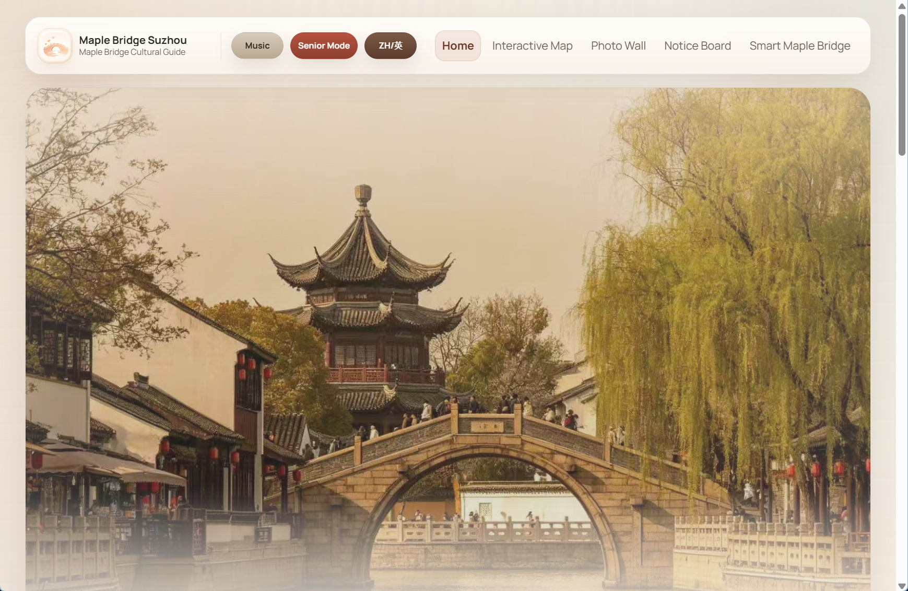
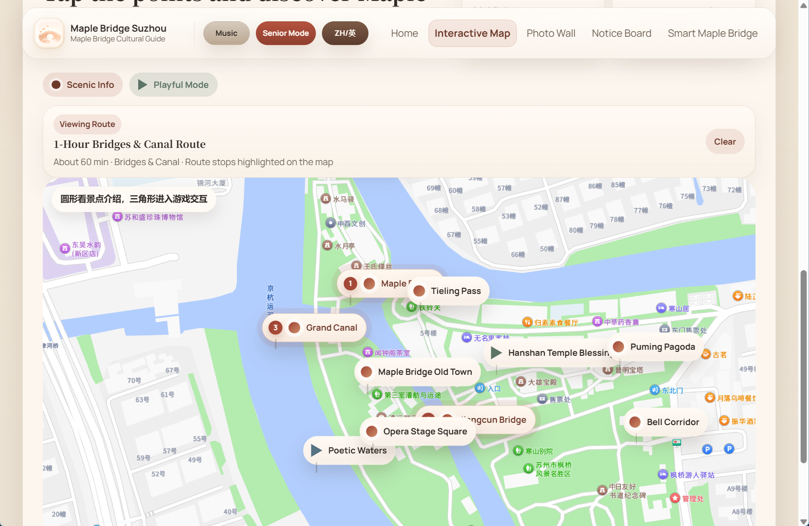
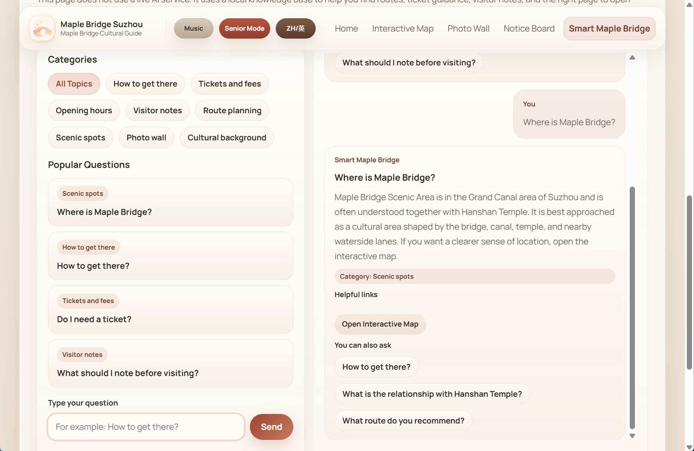

# Maple Bridge — Interactive Cultural Heritage Web Experience

A mobile-first interactive web experience for exploring the cultural heritage of **Maple Bridge (枫桥), Suzhou**.

**[View Live Demo →](https://albertxia-herald.github.io/maple-bridge-CPT208/)**

The project combines cultural storytelling, map-based exploration, multimedia content, visitor guidance, and lightweight interactive experiences in a fully static front-end application.

Originally developed for **CPT208 Human-Centric Computing**, the project focuses on usability, accessibility, mobile interaction, and coherent information design.

---

## Preview

### Homepage

A mobile-first landing experience combining cultural identity, visitor guidance, and access to the main interactive modules.



### Interactive Map & Route Recommendation

An AMap-based exploration interface with scenic hotspots, playful interactions, and route recommendations based on visitor preferences.



### Smart Maple Bridge

A lightweight local knowledge assistant supporting visitor questions, category-based browsing, suggested questions, and contextual links to other parts of the experience.



---

## Overview

Maple Bridge is designed around two levels of interaction:

- **Quick exploration** for visitors who want practical information and a concise introduction
- **Deeper interaction** through maps, cultural content, route recommendations, and playful heritage experiences

The final prototype consists of five connected experiences:

1. Homepage
2. Interactive Map
3. Photo Wall
4. Notice Board
5. Smart Maple Bridge

The interface follows a calm, heritage-inspired visual language while remaining lightweight and mobile-oriented.

---

## Project Highlights

- Mobile-first multi-page interface
- Interactive AMap-based scenic exploration
- Scenic hotspots and information popups
- Route recommendation based on time and interests
- Cultural mini-games and poem-inspired interaction
- Photo-wall browsing experience
- Resident- and visitor-oriented notice board
- Local FAQ-style smart assistant
- Chinese / English interface support
- Senior-mode accessibility option
- Responsive modal and bottom-sheet interactions
- Static architecture with no backend dependency

---

## Core Experiences

### Homepage

The homepage provides a concise introduction to Maple Bridge and serves as the main navigation hub.

Key interactions include:

- rotating visual hero section
- visit and transport guidance
- travel-detail bottom sheets
- entrances to the major interactive pages
- responsive navigation for desktop and mobile

### Interactive Map

The map is the main exploration experience.

Users can:

- browse real geographic map content
- open scenic-location information
- interact with cultural hotspots
- select route preferences
- receive route recommendations
- highlight suggested routes on the map
- access mini-games and poem-related experiences

Touch behavior is adapted for mobile use so page scrolling and map interaction can coexist more naturally.

### Photo Wall

The photo wall provides an image-focused way to explore the atmosphere and visual identity of Maple Bridge.

It complements the more information-heavy map and notice-board experiences with a lighter gallery interface.

### Notice Board

The notice board organizes scenic-area, visitor-service, cultural-event, and community-oriented information.

The design prioritizes:

- readability
- structured information
- important-notice highlighting
- clear status and detail presentation

### Smart Maple Bridge

Smart Maple Bridge is a lightweight local knowledge assistant built without an external AI service.

It supports common visitor questions about:

- transport
- tickets
- opening information
- scenic locations
- visitor guidance
- route planning
- cultural background

Suggested questions, topic categories, and fallback guidance help users find relevant information quickly.

---

## Human-Centered Design

The project was developed with several HCI-oriented principles:

- clear visual hierarchy
- low cognitive load on the homepage
- mobile-first interaction
- sufficiently large touch targets
- semantic structure
- readable contrast
- progressive disclosure of information
- accessibility-oriented controls
- restrained cultural decoration

The aim was to keep the interface culturally expressive without allowing decorative elements to interfere with usability.

---

## Tech Stack

**Frontend**

- HTML5
- CSS3
- Vanilla JavaScript

**External Services**

- AMap Web SDK

**Design / Interaction**

- responsive web design
- mobile-first layouts
- modal and bottom-sheet interfaces
- client-side localization
- static local knowledge base

The application does not require a build pipeline or backend service.

---

## Project Structure

```text
maple-bridge-CPT208/
├── index.html
├── interactive-map.html
├── photo-wall.html
├── notice-board.html
├── smart-agent.html
│
├── script.js
├── interactive-map.js
├── photo-wall.js
├── notice-board.js
├── smart-agent.js
├── smart-agent-data.js
├── zoomable-image-viewer.js
│
├── styles.css
├── images/
├── audio/
├── assets/
└── references/
```

---

## Running Locally

No installation or build step is required.

Clone the repository:

```bash
git clone https://github.com/AlbertXia-herald/maple-bridge-CPT208.git
cd maple-bridge-CPT208
```

Then either:

1. open `index.html` directly in a browser, or
2. run the project with a lightweight local static server.

A local static server is recommended for the most consistent resource-loading behavior.

---

## Demo Flow

A representative walkthrough is:

1. Start from the homepage and explore the hero and visitor-guidance interactions
2. Open **Smart Maple Bridge** and test suggested visitor questions
3. Enter the **Interactive Map** and explore scenic hotspots
4. Generate a route recommendation and view the highlighted route
5. Explore the **Photo Wall**
6. Finish with the **Notice Board**

---

## Project Scope

This repository represents a polished academic prototype rather than a production tourism service.

Current scope limitations include:

- no authentication system
- no persistent database
- no production CMS
- no backend API
- local FAQ logic rather than a live LLM
- some content remains prototype-oriented

Visitor information such as opening hours, transport guidance, or ticket details should therefore be treated as demonstration content unless independently verified.

---

## Course Context

This project was developed as part of **CPT208 Human-Centric Computing** at Xi'an Jiaotong-Liverpool University.

The coursework emphasized the design and implementation of a usable, accessible, and human-centered interactive system.

This repository is presented as an engineering and HCI portfolio project.

---

## Author

**Jiahao Qi**

BSc Information and Computing Science  
Xi'an Jiaotong-Liverpool University

GitHub: [@AlbertXia-herald](https://github.com/AlbertXia-herald)
